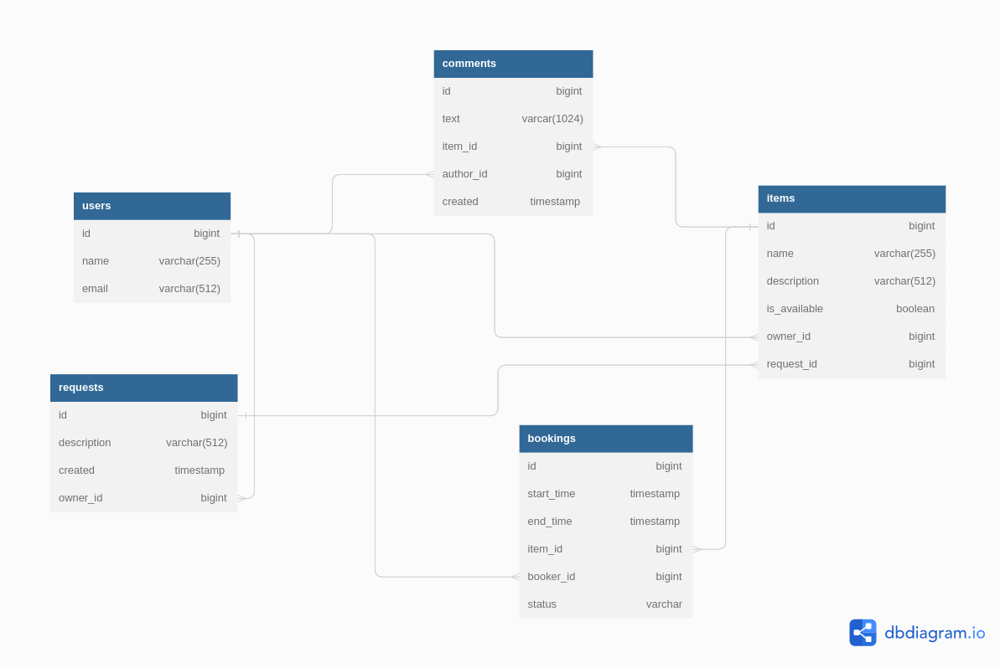

## Бэкенд учебного приложения "Сервис совместного использования вещей" на основе микросервисной архитектуры с юнит и интеграционными тестами

### Стек технологий:
Java SE, Spring Boot, Hibernate, PostgreSQL, Maven, Docker, Lombok, JDBC, JUnit, mockito

### Функциональность
Приложение предоставляет пользователям возможность рассказывать, какими вещами они готовы поделиться, искать нужную вещь и брать её в аренду на время.
Позволяет не только бронировать вещь на определённые даты, но и закрывать к ней доступ на время бронирования от других желающих.
Если нужной вещи на сервисе нет, имеется возможность оставлять запросы. По запросу можно добавлять новые вещи для шеринга.

### Структура
Два сервиса:
* *gateway* - отвечает за взаимодействие с пользователями, содержит логику валидации входных данных (за исключением требующей работы с БД), переадресовывает запросы в основной сервис
* *server* - выполняет основную работу, в том числе, обращается к БД (PostgreSQL 42.5.0)

Сервисы и БД располагаются в отдельных Docker-контейнерах, их взаимодействие настроено через Docker Compose

Взаимодействие сервисов организовано через RestTemplate

### Запуск:
* требуется установленные Docker (при разработке использовалась версия 3.8) и Docker Compose
* в корневой папке проекта открыть терминал и выполнить команду 'docker-compose up'

Порядок запуска контейнеров: БД, server, gateway
---
### Визуализация результатов работы
Коллекции тестов Postman:
* [основной сервис - ewm-main-service.json](https://github.com/Evgeny2835/Explore-with-me/blob/main/postman/ewm-main-service.json)
* [сервис статистики - ewm-stat-service.json](https://github.com/Evgeny2835/Explore-with-me/blob/main/postman/ewm-stat-service.json)

### ER диаграмма

### Основной сервис
Три части (публичная, закрытая, административная)

Публичный API предоставляет возможности поиска и фильтрации событий:
* сортировка списка событий организована по количеству просмотров (запрашивается в сервисе статистики)
* при просмотре списка событий возвращается только краткая информация о мероприятиях
* просмотр подробной информации о конкретном событии настроен через отдельный эндпоинт
* предусмотрена возможность получения всех имеющихся категорий и подборок событий (такие подборки должны составлять
  администраторы ресурса)
* каждый публичный запрос для получения списка событий или полной информации о мероприятии фиксируется
  сервисом статистики

Закрытая часть API реализует возможности зарегистрированных пользователей продукта:
* авторизованные пользователи имеют возможность добавлять в приложение новые мероприятия, редактировать их и
  просматривать после добавления
* настроена подача заявок на участие в интересующих мероприятиях
* создатель мероприятия имеет возможность подтверждать заявки, которые отправили другие пользователи сервиса

Административная часть API предоставляет возможности настройки и поддержки работы сервиса:
* настроено добавление, изменение и удаление категорий для событий
* имеется возможность добавлять, удалять и закреплять на главной странице подборки мероприятий
* предусмотрена модерация событий, размещённых пользователями (публикация или отклонение)
* настроено управление пользователями (добавление, просмотр, удаление)

### Сервис статистики
Реализует задачу сбора информации, на основе которой формируется статистика о работе приложения:
* о количестве обращений пользователей к спискам событий
* о количестве запросов к подробной информации о событии

### Подробная спецификация API:
* [основной сервис - ewm-main-service-spec.json](https://github.com/Evgeny2835/Explore-with-me/blob/main/ewm-main-service-spec.json)
* [сервис статистики - ewm-stats-service-spec.json](https://github.com/Evgeny2835/Explore-with-me/blob/main/ewm-stats-service-spec.json)

Для просмотра файлов используйте редактор, например [Swagger](https://editor-next.swagger.io/)

Сервис:
* предоставляет пользователям возможность: 
    * рассказывать, какими вещами они готовы поделиться; 
    * находить нужную вещь и брать её в аренду на какое-то время; 
    * оставлять запросы на случай, если нужной вещи на сервисе нет; 
* позволяет бронировать вещь на определённые даты и закрывать доступ к ней на время 
  бронирования от других желающих; 
* по запросу позволяет добавлять новые вещи для шеринга. 

